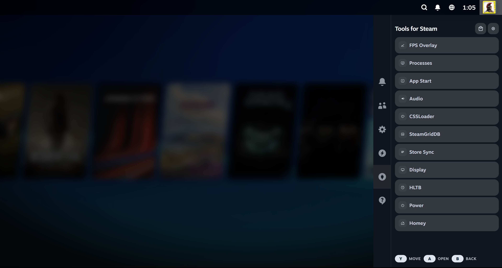

<div align="center">

# Tools for Steam

### A controller-first Windows console layer for Steam Big Picture

[](https://github.com/toonymak1993/tools-for-steam/releases)
[](#requirements)
[](sdk/QUICKSTART.md)
[](#three-startup-modes)

Tools for Steam (TFS) brings a SteamOS-style experience to Windows gaming PCs and handhelds. It integrates directly into Steam's Quick Access panel, starts cleanly into Big Picture, and keeps the important Windows and gaming controls reachable without leaving the controller.

[Download a release](https://github.com/toonymak1993/tools-for-steam/releases) · [Build a plugin](sdk/QUICKSTART.md) · [Developer guide](sdk/DEVELOPER_GUIDE.md) · [Plugin database](https://github.com/toonymak1993/tfs-plugin-database)

</div>



> [!IMPORTANT]
> The current public build is a beta. TFS changes the current user's startup experience and integrates with Steam UI surfaces that can change after Steam updates. Read [Safety and recovery](#safety-and-recovery) before enabling Shell or Xbox Mode.

## Why Tools for Steam?

Windows is a powerful gaming platform, but it was not designed to feel like a console from the sofa. TFS connects the missing pieces:

| Console feature | What TFS provides |
|---|---|
| Native controller UI | A Tools for Steam tab inside Steam Quick Access, built for `A`, `B`, bumpers, D-pad, and sticks |
| Console startup | Shell Mode or the signed Xbox Mode Gaming Home package starts the gaming session without exposing the normal desktop first |
| One gaming hub | Launcher discovery, non-Steam shortcuts, collections, and SteamGridDB artwork |
| System controls | Audio, displays, windows, performance, themes, apps, power, and recovery from Big Picture |
| Extensible platform | A Community Store and public SDK 1.0 with normal, native, and Decky-style full-trust plugins |

TFS is part of **GCM — Gaming Console Mode**. The goal is simple: on a living-room PC or handheld, Steam should be the first-class home experience while Windows remains recoverable underneath.

## Highlights in the first official beta

- Responsive, controller-native TFS Store with Discover, Built-In, Community, Installed, and Updates sections.
- Public Plugin SDK `1.0.0` with TypeScript definitions, schemas, templates, packaging, validation, and one-command sideloading.
- Sandboxed storage, protected secrets, network allowlists, private files, notifications, logs, lifecycle helpers, and change-only events.
- Reviewed native bridges for audio, processes, displays, CSSLoader, artwork, App Start, Store Sync, automation, performance, and power.
- `native.full-trust` escape hatch for executable, PowerShell, Python, or Node backends, JSON-RPC, arbitrary files, UAC, processes, and selected Steam CEF surfaces.
- Community package checks for SDK compatibility, permission parity, safe ZIP extraction, update permission changes, and SHA-256 integrity.
- Signed Xbox Mode host package with installer recovery, rollback snapshots, and diagnostic collection.
- Controller focus and Store card layout fixes across 720p, 1080p, and larger displays.

## TDP Control and handheld support

This beta includes our first dedicated **Handheld Performance / TDP Control plugin**.

The first verified device is the **MSI Claw A8** (`MS-1T8K`). On supported hardware the plugin appears automatically and provides:

- direct TDP control from **15 W to 35 W**;
- Battery `15 W`, Balanced `20 W`, and Performance `28 W` presets;
- separate plugged-in and battery limits;
- automatic per-game TDP profiles;
- live battery, power-source, applied-TDP, and game information;
- profile notifications and automatic restoration of the global profile;
- elevated hardware access through the bundled PawnIO-based helper.

The plugin stays hidden on unverified devices instead of applying unknown hardware commands. **More handheld models will follow** as their hardware identity, safe limits, and control path are verified.

## Built-in tools

| Tool | Purpose |
|---|---|
| **FPS Overlay** | FPS, frametime, process, CPU, and memory telemetry with Steam-style overlay controls |
| **Processes** | List visible windows and bring an app to the foreground |
| **App Start** | Curate and launch installed Windows apps with a controller |
| **Store Sync** | Discover launcher libraries, create Steam shortcuts and collections, and refresh artwork |
| **SteamGridDB** | Search and apply game artwork from Steam context menus or settings |
| **Audio** | Switch playback devices, control volume, and manage mixer state |
| **Display** | Switch displays, resolutions, and refresh rates |
| **CSSLoader** | Control local themes, profiles, presets, and backend tools |
| **HLTB** | Show HowLongToBeat estimates on supported game pages |
| **Auto SISR** | Optional marker-mode automation for selected non-Steam games |
| **Homey** | Optional rooms, lights, moods, colors, and flows integration |
| **Power** | Restart Steam, recover Explorer, sleep, restart, or shut down safely |

Most tools can be hidden from TFS Settings. Safety and recovery actions remain available.

## Community Store

The Store is designed to work entirely with a controller and keeps plugin trust visible before installation:

- built-in and community discovery;
- install, update, uninstall, enable, disable, and hide flows;
- preview cards with responsive fallback artwork;
- SDK version, publisher, permissions, network hosts, and full-trust warnings;
- checksum verification and strict package/manifest/catalog parity;
- local developer catalogs for sideloading without changing TFS Core.

The official catalog lives in [`tfs-plugin-database`](https://github.com/toonymak1993/tfs-plugin-database). The first official community example is **Home Assistant 0.2.0**, built entirely with SDK 1.0 storage, secrets, network, and controller UI capabilities.

## Plugin SDK 1.0

SDK 1.0 is built for trusted gaming plugins in the same spirit as Decky Loader. A normal plugin can stay capability-based; a full-trust plugin can bundle its own backend when the Core does not expose enough.

```powershell
# Create a plugin
.\scripts\tfs-plugin.ps1 new .\plugins\my-plugin -Id my-plugin -Name "My Plugin"

# Validate and sideload it into the local TFS Store
.\scripts\tfs-plugin.ps1 validate .\plugins\my-plugin
.\scripts\tfs-plugin.ps1 sideload .\plugins\my-plugin
```

Developer resources:

- [Ten-minute quickstart](sdk/QUICKSTART.md)
- [Complete API and Xbox Mode guide](sdk/DEVELOPER_GUIDE.md)
- [SDK contract and permission reference](sdk/README.md)
- [Store submission guide](sdk/SUBMITTING.md)
- [TypeScript declarations](sdk/tfs-plugin-sdk.d.ts)
- [Standalone starter repository](https://github.com/toonymak1993/tfs-plugin-template)
- [Full-trust backend template](sdk/full-trust-plugin-template/)

SDK v1 evolves additively. Breaking runtime changes require a future SDK major version so existing plugins can remain loadable.

## Three startup modes

### Shell Mode

TFS starts before Explorer, prepares Steam Big Picture and the local bridge, then restores Explorer behind Steam. This provides the broadest console-style flow on normal Windows 10 and Windows 11 systems.

### Xbox Mode

On compatible Windows 11 systems with Gaming FSE support, TFS installs a signed Gaming Home package and becomes the controller-first gaming home while Explorer remains the Windows shell. The installer hides this option when the platform capability is unavailable.

### Tray Mode

Windows starts normally and TFS runs quietly as a tray-style launcher service. This is the least invasive option and the easiest starting point for testing the beta.

## Requirements

- Windows 10 or Windows 11 x64;
- Steam with Big Picture / Gamepad UI;
- a controller for the intended console experience;
- permission to install per-user software under `%LOCALAPPDATA%`;
- compatible Windows 11 Gaming FSE support specifically for Xbox Mode.

TFS starts Steam with the required local DevTools endpoint on `127.0.0.1:8080` when necessary. If Steam is already running without it, TFS can perform one controlled restart to attach correctly. The local TFS API listens on `127.0.0.1:47652` and uses a private session token for protected routes.

## Install and update

1. Open [GitHub Releases](https://github.com/toonymak1993/tools-for-steam/releases).
2. For the first official beta, expand the newest **Pre-release** entry.
3. Download `ToolsForSteamSetup.exe`.
4. Run the installer and choose Tray, Shell, or Xbox Mode when available.

The installer:

- installs per-user under `%LOCALAPPDATA%\Programs\ToolsForSteam`;
- verifies platform and Xbox Mode requirements;
- safely leaves an active Xbox Mode session before replacing files;
- closes TFS, helpers, Xbox Host, and Steam when required;
- creates a rollback snapshot before an update;
- installs the signed Xbox Host package and public certificate;
- restores a safe startup mode if setup cannot complete;
- writes Xbox Mode diagnostics for failed installations.

Installed builds can update from GitHub releases. Public installer assets are named `ToolsForSteamSetup.exe`.

## Safety and recovery

TFS changes only the current user's shell/startup configuration. It does not replace Windows system files.

If the gaming shell does not start correctly:

- open `Tools for Steam > Settings` and switch back to Tray Mode;
- use `Tools for Steam > Power > Start Windows Desktop`;
- start Explorer from the TFS tray recovery actions;
- press `Ctrl+Shift+Esc`, open Task Manager, and run `explorer.exe`;
- uninstall from Windows Apps or the Start Menu entry;
- use the rollback snapshot stored under the TFS data directory after an interrupted upgrade.

## Build from source

```powershell
dotnet build .\SteamLoader.slnx
dotnet run --project .\src\SteamLoader.App\SteamLoader.App.csproj
```

Build the complete installer, including the signed Xbox Host package:

```powershell
powershell -ExecutionPolicy Bypass -File .\scripts\publish-installer.ps1
```

Outputs:

- `dist\installer\ToolsForSteamSetup.exe` — public installer;
- `dist\installer\ToolsForSteamSetup-<version>.exe` — versioned copy;
- `dist\portable\ToolsForSteam.exe` — internal installer payload.

The Xbox Host build requires the configured TFS signing certificate. The outer installer should also be Authenticode-signed for broad public distribution.

## Repository map

| Path | Purpose |
|---|---|
| `src/SteamLoader.App/Hosting` | Local API, Store routes, Steam injection, and live state |
| `src/SteamLoader.App/Infrastructure` | Audio, displays, handhelds, Store Sync, Steam, themes, artwork, and native services |
| `src/SteamLoader.App/Assets` | Quick Access, Store, game-page, controller, and Steam UI assets |
| `src/ToolsForSteam.XboxHost` | Signed Gaming Home / Xbox Mode package |
| `sdk` | Public SDK, schemas, documentation, and official examples |
| `scripts` | Build, package, sideload, installer, and release helpers |
| `installer` | Inno Setup definition and Xbox Mode recovery tools |
| `tests` | Runtime, SDK, Store, Xbox Mode, launcher, and update regression tests |

## Beta status

This is the first official beta of the complete TFS platform: console startup, Xbox Mode, built-in tools, Community Store, SDK 1.0, Home Assistant example, and the first MSI Claw A8 TDP integration.

Feedback is especially useful for:

- Steam Beta and stable-client UI compatibility;
- controller focus at 720p, 1080p, ultrawide, and 4K;
- fresh installs and upgrades while Xbox Mode is active;
- MSI Claw A8 power limits and automatic game profiles;
- third-party SDK plugins and full-trust backends.

Some internal namespaces still use the original `SteamLoader` codename; the user-facing product and public SDK are **Tools for Steam / TFS**.
