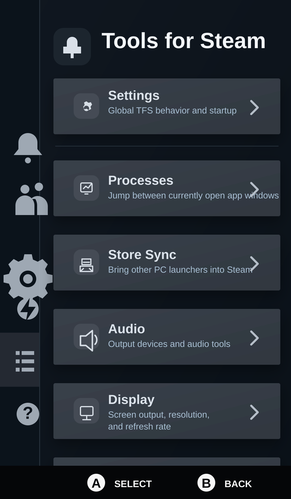
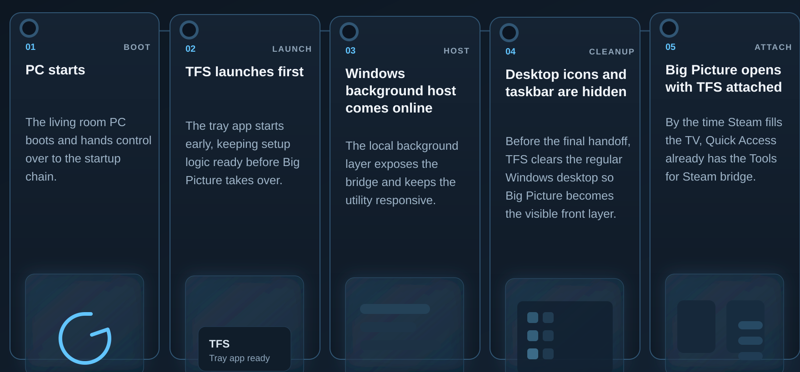

# Tools for Steam

Tools for Steam (TFS) brings a SteamOS-style console experience to Windows PCs that are used mainly with Steam Big Picture. It adds a native-feeling Tools for Steam tab to Steam's Quick Access side panel and ships with built-in tools for audio, app launching, display control, launcher sync, themes, HLTB, window switching, and recovery actions.

This release is part of **GCM - Gaming Console Mode**. The goal is simple: when a living-room PC boots, the first thing you should see is Steam Big Picture, not the Windows desktop.



## What TFS Does

- Starts before the normal Windows desktop when console startup is enabled.
- Launches Steam Big Picture with the local bridge required for the Quick Access integration.
- Adds a Tools for Steam tab to Steam's native side panel.
- Syncs supported launcher libraries and custom game folders into Steam.
- Can hide the Windows taskbar and desktop icons while Big Picture is active.
- Restores Explorer behind Steam after the startup flow so Windows remains usable.
- Updates from GitHub releases through the installed app.

## Console Startup

Tools for Steam can change the current user's Windows shell so TFS launches first at sign-in. This is how it can imitate a SteamOS-like boot flow on Windows: TFS starts, prepares the background host, starts Steam Big Picture, hides the regular desktop layer, and then hands the session back to Windows Explorer behind Steam.



This shell behavior is intentional and can be disabled again from `Tools for Steam > Settings`. If something goes wrong, the `Power` plugin and desktop manager both provide recovery actions to start Windows Explorer manually.

## Built-In Plugins

- `Settings`: Global TFS startup behavior, desktop manager access, and plugin enable/disable controls.
- `Processes`: See visible app windows and bring one to the foreground from the controller.
- `App Start`: Add installed Windows apps from the Start Menu and launch them later from the controller.
- `Store Sync`: Import supported launcher games and custom folders into Steam as non-Steam games, with SteamGridDB artwork support.
- `Audio`: Switch Windows output devices and adjust system volume from Big Picture.
- `Display`: Switch internal/external display output and choose supported resolution or refresh-rate presets.
- `Power`: Restart Steam, recover the Windows desktop, sleep, reboot, or shut down the PC.
- `HLTB`: Show HowLongToBeat estimates on supported Big Picture game pages.
- `Themes`: Apply and manage bundled Steam UI themes and profiles.

Plugins can be disabled from `Settings`. Disabled plugins are hidden from the TFS home screen and their background routes are blocked.

## Requirements

- Windows 10 or newer.
- Steam installed.
- Steam Big Picture / Gamepad UI.
- A user account where changing the current user's shell is acceptable.

Tools for Steam starts Steam with the required local DevTools endpoint on `127.0.0.1:8080` when needed. If Steam is already running without that endpoint, TFS may perform one controlled Steam restart so it can attach correctly.

## Install

Download `ToolsForSteamSetup.exe` from the latest GitHub release and run it.

The installer:

- installs per-user under `%LOCALAPPDATA%\Programs\ToolsForSteam`
- shows the license before installation
- closes running TFS processes automatically during setup
- creates Start Menu entries
- starts the TFS console startup flow after installation

## Updates

Installed builds can check for and install updates from GitHub releases. The updater looks for the latest release asset named:

```text
ToolsForSteamSetup.exe
```

Updates are expected. TFS touches Steam UI surfaces that can change when Steam updates, so future releases will improve compatibility, plugins, themes, and the console startup experience.

## Safety And Recovery

Because TFS can take over the current user's shell, it is important to know how to recover:

- Open `Tools for Steam > Settings` to disable console startup.
- Use `Tools for Steam > Power > Start Windows Desktop` to bring Explorer back.
- Start the desktop manager from the tray icon or Start Menu if you need a normal Windows window.
- Uninstall from Windows Apps settings or the Start Menu uninstall entry.

TFS only changes the current user's shell configuration. It does not replace Windows system files.

## Build From Source

```powershell
dotnet build .\SteamLoader.slnx
dotnet run --project .\src\SteamLoader.App\SteamLoader.App.csproj
```

The background host serves a local API on `http://127.0.0.1:47652/` and injects the Quick Access UI into Steam Big Picture when Steam is available.

## Build The Installer

Inno Setup 6 is used for the Windows installer.

```powershell
powershell -ExecutionPolicy Bypass -File .\scripts\publish-installer.ps1
```

Outputs:

- `dist\installer\ToolsForSteamSetup.exe`
- `dist\portable\ToolsForSteam.exe`
- `dist\ToolsForSteam-portable-win-x64.zip`

## Repository Layout

- `src/SteamLoader.App/Hosting`: local API host and Steam injection loop
- `src/SteamLoader.App/Infrastructure/Steam`: Steam DevTools communication
- `src/SteamLoader.App/Infrastructure/Audio`: Core Audio integration
- `src/SteamLoader.App/Infrastructure/Display`: Windows display switching and mode selection
- `src/SteamLoader.App/Infrastructure/StoreSync`: launcher scanning, shortcut sync, and artwork download
- `src/SteamLoader.App/Infrastructure/Themes`: theme state, CSS resolution, and profiles
- `src/SteamLoader.App/Infrastructure/Hltb`: HowLongToBeat integration
- `src/SteamLoader.App/Assets`: injected Quick Access UI and Big Picture surface scripts

## Status

Tools for Steam is ready for its first public release, but it will continue to evolve. Some internals still use the older `SteamLoader` codename while the user-facing product is now `Tools for Steam` / `TFS`.

Feedback from real Big Picture systems is welcome, especially around startup behavior, Steam UI updates, and controller-first navigation.
